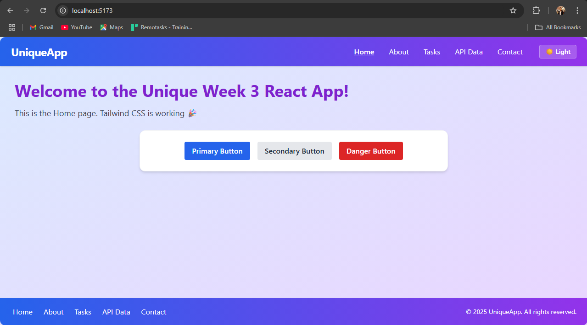
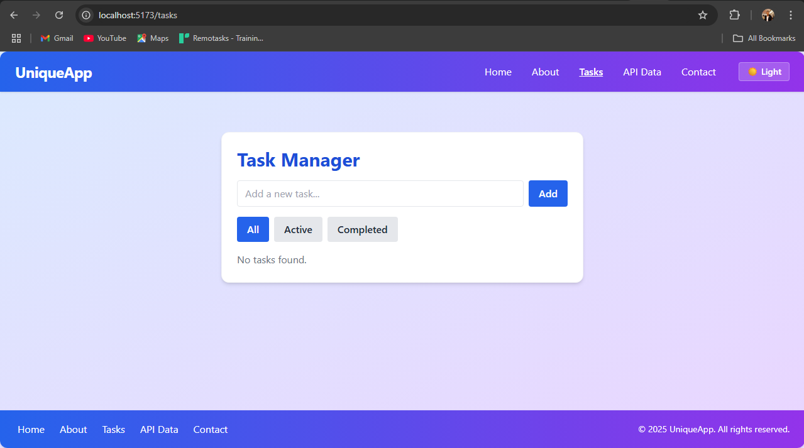
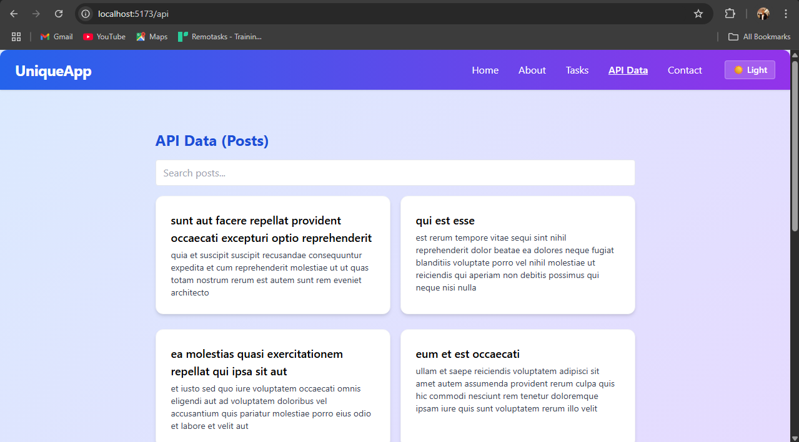

# Unique Week 3 React App

A modern, responsive React application built by Jeff Mbita(Me) for the Week 3 assignment. This project demonstrates my skills in React, Vite, Tailwind CSS, component architecture, state management, hooks, API integration, and global dark mode.

## 🚀 Features
- Fully responsive design for all devices
- Global light/dark theme switcher
- My own reusable UI components (Button, Card, Navbar, Footer, Layout)
- Task Manager with persistent tasks (add, complete, delete, filter)
- API integration with search, infinite scroll, and error/loading states
- Clean, maintainable code with custom hooks and context

## 🛠️ Setup Instructions
1. **Clone the repository:**
   ```bash
   git clone <your-repo-url>
   cd week3-unique-app
   ```
2. **Install dependencies:**
   ```bash
   npm install
   ```
3. **Start the development server:**
   ```bash
   npm run dev
   ```
4. **Build for production:**
   ```bash
   npm run build
   ```

## 🌐 Deployed Application
- [Live Demo](<your-deployed-url-here>)

## 📸 My App Screenshots
Below are screenshots of my actual application:





## 📂 Project Structure
```
src/
├── api/           # API integration functions
├── components/    # My reusable UI components
├── context/       # My React context providers
├── hooks/         # My custom React hooks
├── pages/         # Page components
├── utils/         # Utility functions
├── App.jsx        # (Optional) Main app wrapper if needed
├── main.jsx       # Entry point
└── index.css      # Tailwind CSS imports and custom styles
```

## 🙏 Credits
- Built by [Your Name Here]
- [Vite](https://vitejs.dev/)
- [React](https://react.dev/)
- [Tailwind CSS](https://tailwindcss.com/)
- [JSONPlaceholder API](https://jsonplaceholder.typicode.com/)

---
This project is my own work for the Week 3 assignment. All screenshots and code are original.


